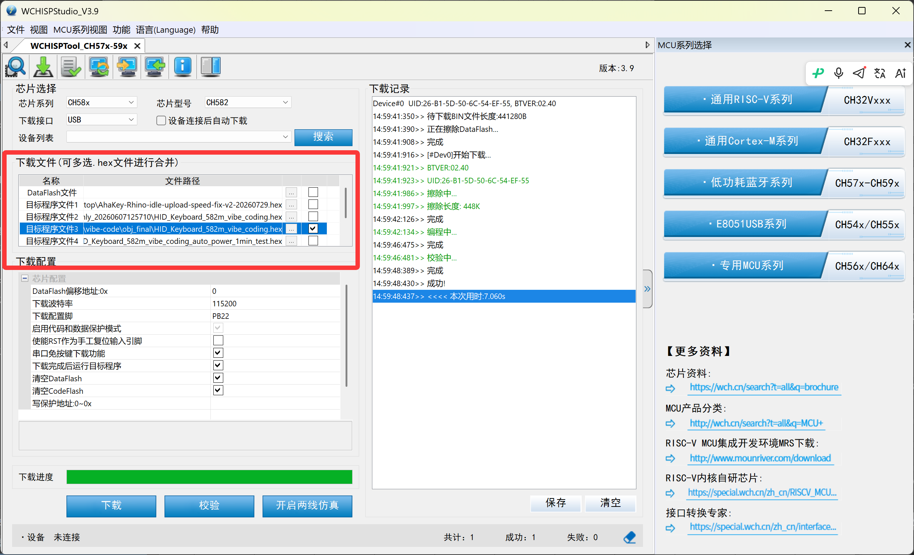
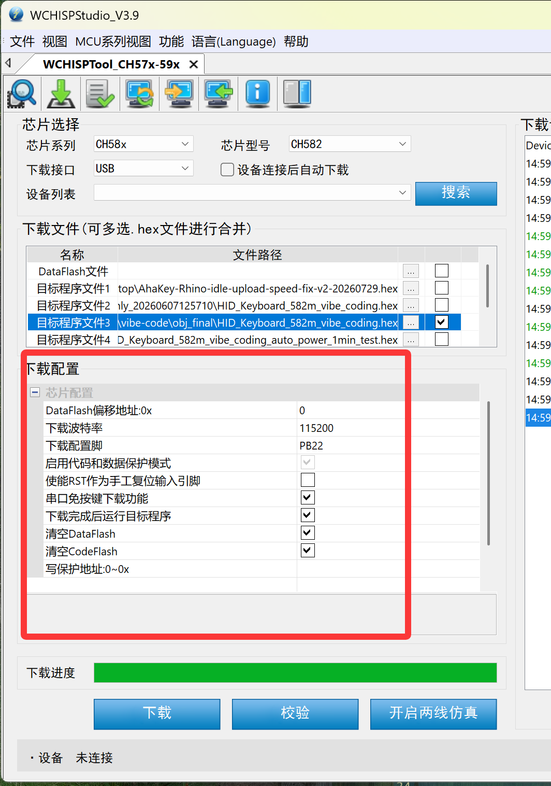
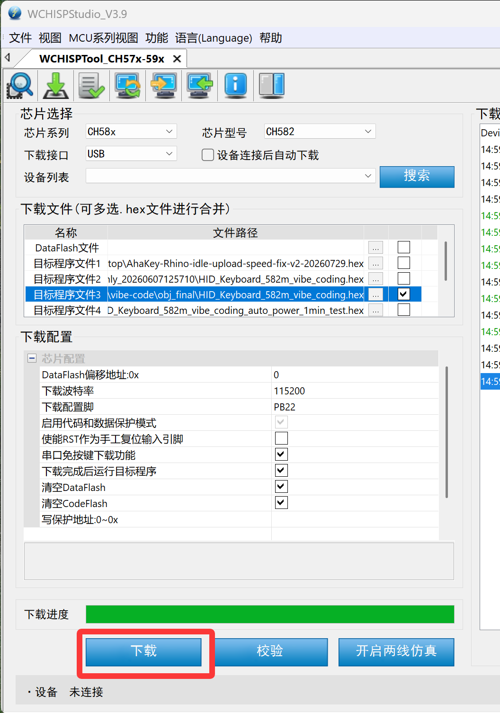
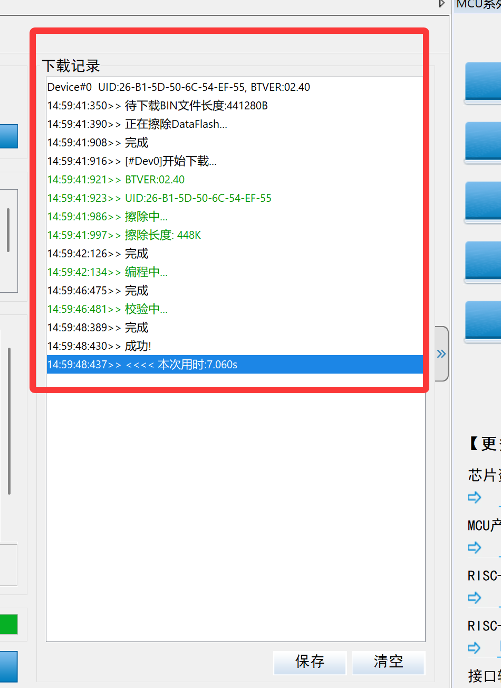

# AhaKey X1 烧录教程

## 适用范围

本教程适用于 AhaKey X1 官方 HEX 固件的烧录、升级和回退。

## 视频教程

可以先看完整视频，再按下面的图文步骤操作。

<video src="assets/flash-demo.mp4" controls width="100%"></video>

如果浏览器没有直接显示视频，可以直接下载这个6.7MB的视频：[assets/flash-demo.mp4](assets/flash-demo.mp4)。

## 准备材料

- AhaKey X1
- Windows 电脑
- 支持数据传输的 Type-C 数据线
- WCHISPTool
- 需要烧录的 `.hex` 文件

## 第 1 步：下载 WCHISPTool

请从沁恒官方页面下载 WCHISPTool：

[https://www.wch.cn/downloads/WCHISPTool_Setup_exe.html](https://www.wch.cn/downloads/WCHISPTool_Setup_exe.html)

下载后安装并打开 WCHISPTool。

## 第 2 步：从 GitHub Releases 下载 HEX

| 版本 | 口径 | 下载 |
|---|---|---|
| v1.1.0 | 目前出厂会烧录的固件 / 当前推荐版本 | [AhaKey X1 Firmware v1.1.0](https://github.com/AhakeyAI/firmware/releases/tag/AhaKey-X1-v1.1.0) |
| v1.0.0 | 之前的老版本 | [AhaKey X1 Firmware v1.0.0](https://github.com/AhakeyAI/firmware/releases#release-AhaKey-X1-v1.0.0) |

普通用户优先下载 `v1.1.0`。只有需要回到之前老版本行为时，才选择 `v1.0.0`。

## 第 3 步：进入烧录模式

1. 让键盘关机。
2. 打开 WCHISPTool。
3. 按住键盘语音键。
4. 保持按住语音键，同时插入 Type-C。
5. 等待 WCHISPTool 识别设备。

如果 WCHISPTool 没有识别设备，请确认 Type-C 线支持数据传输，然后换一个 USB 口重试。

## 第 4 步：选择 HEX

在 WCHISPTool 的“下载文件”区域中，选择一个“目标程序文件”位置，点击右侧的 `...`，选择刚从 GitHub Releases 下载的 `.hex` 文件。

选择完成后，只勾选当前要烧录的那一行 HEX。不要同时勾选多个不相关的 HEX。

## 第 5 步：确认下载配置

选择 HEX 后，请确认“下载配置”区域的选项。推荐按下图保持：

- 下载波特率：`115200`
- 下载配置脚：`PB22`
- 勾选“串口免按键下载功能”
- 勾选“下载完成后运行目标程序”
- 勾选“清空DataFlash”
- 勾选“清空CodeFlash”
- 不勾选“使能RST作为手工复位输入引脚”

如果 WCHISPTool 中“启用代码和数据保护模式”显示为灰色不可修改，可以保持默认状态。

## 第 6 步：点击 Download

确认 HEX 和下载配置后，点击窗口下方的“下载”按钮开始烧录。

烧录时不要拔掉 Type-C 数据线，也不要关闭 WCHISPTool。

## 第 7 步：确认烧录成功

烧录完成后，右侧“下载记录”区域会出现“成功!”字样，并显示本次用时。

## 第 8 步：烧录完成后重新连接

烧录完成后：

1. 重新插拔 Type-C，或重新开关键盘。
2. 在系统蓝牙中删除旧的 AhaKey 配对记录。
3. 重新连接 AhaKey X1 蓝牙。
4. 打开 AhaKey 客户端并重新连接设备。
5. 测试按键、蓝牙连接和客户端识别是否正常。

## 常见问题

### WCHISP 没有弹出选择固件窗口

- 确认键盘已经关机。
- 确认是先按住语音键，再插入 Type-C。
- 确认 Type-C 线支持数据传输，不是只能充电的线。
- 换一个 USB 口后重试。

### 电脑识别不到设备

- 换一根支持数据传输的 Type-C 线。
- 换一个电脑 USB 口。
- 关闭 WCHISPTool 后重新打开。
- 重新按住语音键并插入 Type-C。

### 烧录完成后蓝牙无法连接

- 在系统蓝牙设置里删除旧的 AhaKey 配对记录。
- 重新开关键盘。
- 重新搜索并连接 AhaKey X1。

### 烧录后 AhaKey 客户端无法连接

- 确认系统蓝牙已经连接 AhaKey X1。
- 关闭并重新打开 AhaKey 客户端。
- 在客户端中重新搜索设备。
- 如果仍然无法连接，重新开关键盘后再试。

### 不确定该烧录哪个版本

优先选择 `v1.1.0`。这是目前出厂会烧录的固件 / 当前推荐版本。
